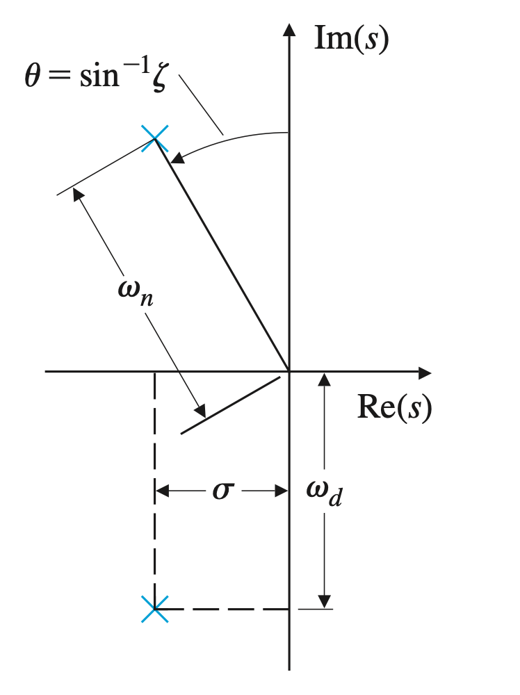

# 자동제어 중간

날짜: 2022년 10월 14일 → 2022년 10월 27일
태그: 중간

- [ ]  교재 완독 및 문제풀이
    - [ ]  개념 및 수식 : 쓰임 및 원리 (10.14 ~ 10.16) + 과제
    - [ ]  예제 풀이 & 연습문제

- [ ]  강의록 완독(1회)
    - [ ]  교재의 개념 재확인
    

# 개념정리

## 중첩의 원리

중첩의 원리가 적용되면 함수 및 응답을 쪼개고 확장하는 것이 가능

→ 주어진 입력신호가 개별적인 입력 신호의 합으로 표현 가능할 때

→ 시스템의 응답 또한 개별적으로 표현이 가능하다는 거

해당 법칙은 선형시스템에서만 성립

## 시불변(LTI system)

입력시간이 $\tau$ 만큼 지체되면, 출력이 $\tau$ 만큼 평행이동되는 시스템을 의미한다.

## convolution

필터 계산 : 함수로부터의 값을 원하는 방식으로 제어하기 위함

[https://supermemi.tistory.com/104](https://supermemi.tistory.com/104)

## 펄스 신호와 입력신호

## convolution 적분 : LTI + 중첩의 원리

특정 펄스 입력에 대해 LTI 시스템의 출력은 $\tau$ 시간의 지연에 관계 없이 일정하므로, 단위 입력 함수 $h(t)$ 라 하면 $[\Delta,2\Delta,3\Delta,\cdots,n\Delta]$ 의 시간 지연에 대한 개별적인 응답의 합으로 표현할 수 있을 것이다. 

즉 $n\Delta$ 시간에서의 응답은 다음과 같다.

$$
\Delta u(k\Delta)h_{\Delta}(n\Delta-k\Delta)
$$

시스템의 전체 응답은 개별적인 입력에 따른 응답의 합이라 했으므로,

$$
y(t)=\sum_{k=0}^{k=\infty}\Delta u(k\Delta) h_{\Delta}(t-k\Delta)\\
y(t)=\int_{-\infty}^{\infty} u(\tau)h(t-\tau)d\tau=\int^{-\infty}_{\infty}u(t-\tau_1)h(\tau_1)(-d\tau_1)=\int_{-\infty}^{\infty}u(t-\tau)h(\tau)d\tau
$$

## Convolution to Laplace

$$
\begin{align*}
Y(s)
&=\int_{-\infty}^{\infty}y(t)e^{-st}dt\\
&=\int_{-\infty}^{\infty}\left[\int_{-\infty}^{\infty}h(\tau)u(t-\tau)d\tau \right]e^{-st}dt\\
&=\int_{-\infty}^{\infty}\left[\int_{-\infty}^{\infty}u(t-\tau)e^{-st}dt \right]h(\tau)d\tau\\
&=\left[\int_{-\infty}^{\infty}u(\eta)e^{-s\eta}d\eta \right]\int_{-\infty}^{\infty}h(\tau)e^{-s\tau}d\tau\\
&=U(s)H(s)
\end{align*}
$$

$U(s)$ 는 입력함수의 Laplace 형태이고, 충격응답의 Laplace 변환은 $H(s)$ 이다.

$e^{st}$ 꼴의 입력에 의한 컨볼루션의 결과는 출력 $H(s)e^{st}$ 를 만든다.

$H(s)$ 를 시스템의 전달함수라고 정의한다.

여기서 $s$ 는 실수영역이 아닌 복수수 영역의 값이다. (허수일 수도 있는 것)

만약, $u(t)=e^{st}$ 로 주어진다면,

$$
\begin{align*}
y(t)
&=\int_{-\infty}^{\infty}h(\tau)u(t-\tau)d\tau\\
&=\int_{-\infty}^{\infty}h(\tau)e^{s(t-\tau)}d\tau\\
&=\int_{-\infty}^{\infty}h(\tau)e^{-s\tau}e^{st}d\tau\\
&=\int_{-\infty}^{\infty}h(\tau)e^{-s\tau}d\tau e^{st}\\
&=H(s)e^{st}
\end{align*}
$$

이고, 여기서 중요한 것은,

$$
H(s)=\int_{-\infty}^{\infty}h(\tau)e^{-s\tau}d\tau
$$

임을 알아둡시당~

해당 조건( $u(t)=e^{st}$ ) 일때, 입력은 모든 시간대($-\infty,\infty$) 에서 지수적이고,  위의 식은 `모든 시간대` 에서 정의 되므로 `초기조건` 이 없음을 인지하자.

만약 이상적으로 $H(s)$ 가 주어지고 입력이 지수적으로 주어진다면, 출력은 라플라스 변환을 통해 쉽게 얻을 수 있다. 또한 해당 경우에서 전달함수 $H(s)$ 는 입출력 사이의 `스케일링 항` 일 뿐이다.

그리고 인과적 시스템(($-\infty,0$)이 무시되는)에서

$$
H(s)=\int_{0}^{\infty}h(\tau)e^{-s\tau}d\tau\\
y(t)=\int_{0}^{\infty}h(\tau)u(t-\tau)d\tau
$$

으로 간단하게 나타내진다.

### 예제

시스템이 $\dot{y}+ky=u$ 으로 주어지고 입력 $u$ : $u(t)=e^{st}$ 으로 주어질 때, 모든 시간 $(-\infty,\infty)$ 에서의 출력 $y$ 를 구해본다.

$$
\dot{y}(t)+ky(t)=u(t)=e^{st}\\
y(t)=H(s)e^{st}\\
\Rightarrow \; \;sH(s)e^{st}+kH(t)e^{st}=e^{st}\\
H(s)=\frac{s}{s+k}\\
\therefore y(t)=\frac{1}{s+k}e^{st}
$$

입력이 $e^{st}$ 로 주어졌음에 $y(t)=H(s)e^{st}$ 으로 쓸 수 있고, 주어진 시스템 방정식에 따라 $H(s)$  를 구할 수 있었다. 전달함수는 입출력에 의한 스케일항(계수) 이므로 $y(t)$  를 간단히 얻어낸다.

<aside>
❗ 전달함수 $H(s)$ 는 입출력의 스케일 항, 즉 입력 $U(s)$, 출력 $H(s)$ 의 전달 이득(gain) 으로 작용한다. 즉, 말 그대로 비 : scaling term 으로서 입출력의 Laplace 비이다.

$$
y(t)=\int_{0}^{\infty}h(\tau)u(t-\tau)d\tau
$$

에서는 시스템의 초기조건 이 0이라는 가정($t<0$ 에서 0) 하에

$$
\frac{Y(s)}{U(s)}=H(s)
$$

이 된다.

</aside>

 

만약 입력함수 $u(t)$ 가 `단위충격함수` 인 $\delta(t)$ 으로 주어진다면, $\mathcal{L}(y(t))=H(s)$ 이다.

따라서, $H(s)$ 는 단위충격응답(입력이 그르케 주어질때) $h(t)$ 의 Laplace 변환이다.

dirac delta 함수

-  `dirac delta` 함수
    
    $$
    \delta(t)=0 \;(t\neq0) \; \; \; \;\int_{-\infty}^{\infty} \delta(t)dt=1
    $$
    
    을 만족하는 함수 $\delta(t)$ 를 디랙-델타 함수(또는 `단위충격함수`)라 하고, $\delta(t)$ 가 입력으로 주어질 때의 응답을 `단위충격응답`이라 한다.
    
    만약 함수 $f(t)$ 가 $t=\tau$ 에서 연속이라면, 다음이 성립한다.
    
    $$
    \int_{-\infty}^{\infty}f(\tau)\delta(t-\tau)d\tau=\int_{-\infty}^{\infty}f(\tau)\delta(t-\tau)d\tau=f(t)
    $$
    
    이 같은 성질을 `sift` 성질이라고 한다.

    

dirac delta 예제

- `dirac delta` 예제
    
    $$
    \int_{0}^{\infty}\delta(t)e^{-st}=1
    $$
    
    임을 보인다.
    
    $$
    \int_{-\infty}^{\infty}\delta(t)e^{-st}dt=e^{-s\tau}\int_{-\infty}^{\infty}\delta(t)e^{-st+s\tau}dt=e^{-s\tau}\int_{-\infty}^{\infty}\delta(t)e^{s(\tau-t)}dt
    $$
    
    이므로 함수 $f(t)=e^{st}$ 이고 초기조건 $f(0)=0$ 으로 두면,
    
    $$
    e^{-s\tau}\int_{0}^{\infty}\delta(t)e^{s(\tau-t)}dt=f(-\tau)\int_{0}^{\infty}\delta(t)f(\tau-t)dt
    $$
    
    이므로, `sift` 효과에 의해 준식은 $f(-\tau)f(\tau)=e^{-st}e^{st}=1$ 이 된다.

   

위의 언급된 유도와 조건에 따라, 초기 조건이 0 인 `LTI` 시스템을 특정지을 수 있는 방법을 생각해볼 수 있다.   초기조건이 0이라 했으므로, 단위충격을 인가한 후 해당 응답으로부터 시스템을 알아낼 수 있다.

일반적인 경우(꼭 단위충격이 아니더라도),

$$
\begin{equation*}
a_1\ddot{y}+a_2\dot{y}+a_3y=b_1\ddot{u}+b_2\dot{u}+b_3u
\end{equation*}
$$

으로 초기조건이 0 인 시스템이 주어졌을 때,

$$
(a_1s^2+a_2s+a_3)Y(s)=(b_1s^2+b_2s+b_3)U(s)\\
\therefore H(s)=\frac{Y(s)}{U(s)}=\frac{b_1s^2+b_2s+b_3}{a_1s^2+a_2s+a_3}
$$

과 같이 전달함수를 구해낼 수 있다.

### 주파수 응답

입력함수 $u(t)=A\cos(\omega t)$ 으로 주어졌을 때 시스템의 응답을 알아본다.

오일러 변환에 의하여 아래와 같이 쓸 수 있고,

$$
A\cos(\omega t)=\frac{A}{2}(e^{j\omega t}+e^{-j\omega t})
$$

$u(t)=e^{st}$  으로 주어졌을 때의 응답 $y(t)=e^{st}H(s)$ 에 의하여, $s=j\omega$ 로 두면,

$$
u_1(t)=\frac{A}{2}e^{j\omega t} \; \; \; \;u_2(t)=\frac{A}{2}e^{-j\omega t}\\
y_1(t)=\frac{A}{2}H(j\omega)e^{j\omega t} \; \; \; \; \; \;y_2(t)=\frac{A}{2}H(-j\omega)e^{-j\omega t}\\
\therefore y(t)=\frac{A}{2}(H(j\omega)e^{j\omega t}+H(-j\omega)e^{-j\omega t}
$$

전달함수 $H(j\omega)$ 는 복소수 이므로 극형식 : $H(j\omega)=M(\omega)e^{j\varphi} \; \;H=Me^{j\varphi}$ 으로 치환할 수 있다.

따라서, $y(t)$ 는

$$
\begin{align*}
y(t)
&=\frac{A}{2}M(e^{j(\omega t+\varphi)}+e^{-j(\omega t+\varphi)})\\
&=AM\cos(\omega t+\varphi)
\end{align*}
$$

단, $M=|H(j\omega)| \; \; \;\varphi=\angle H(j\omega)$그

### 극점, 영점과 안정성

전달함수 $H(s)$ 가 다음과 같이 주어졌을 때,

$$
H(s)=\frac{b(s)}{a(s)}=K\frac{\prod_{i=1}^{m}(s-z_i)}{\prod_{i=1}^{n}(s-p_i)}
$$

$b(s)=0$ 의 해가 되는 해집합 $[z_1,z_2,\cdots,z_m]$ 을 시스템의 `유한 영점` 이라 하고,

$a(s)=0$ 의 해가 되는 해집합 $[p_1,p_2,\cdots,p_n]$ 을 시스템의 `극점` 이라 한다.

극점은 시스템의 안정성을 결정짓는 중요한 요소가 되는데, 

분모의 항들은 결국 부분집합의 합으로 표현되기 때문이다. 

예를 들어, $H(s)=\frac{1}{(s+2)(s+1)}$ 일 때, 응답함수 $h(t)=e^{-t}+e^{-2t}$ 로서 외부 충격에 의한 응답이 감쇠하는 형태를 띤다. 그러나 $H(s)=\frac{1}{(s-2)(s-1)}$ 의 경우 응답함수 $h(t)=e^{t}+e^{2t}$ 는 응답이 증가하는 양상을 띤다

즉, 극점이 0보다 크면 시스템이 불안정해지는 것이다.

### 이차미분방정식의 전달함수

전달함수 $H(s)$ 가 이차함수 꼴로 주어질때, 다음과 같이 정리한다.

$$
H(s)=\frac{\omega_n^2}{s^2+2\zeta\omega_ns+\omega_n^2}=\frac{\omega_n^2}{(s+\zeta\omega_n)^2+\omega_n^2(1-\zeta^2)}
$$

따라서 극점은 $s=-\sigma \pm j\omega_d$ 이고, $\sigma=\zeta\omega_n, \; \;\omega_d=\omega_n \sqrt{1-\zeta^2}$  이다.

여기서 $\zeta$ 는 감쇠비, $\omega_n$ 는 비감쇠 고유주파수이다. 극점은 $s$-평면에서 반경: $\omega_n$, 각도: $\theta=\sin^{-1}\zeta$ 이다.

이에 따른 응답 $h(t)$ 가 다음과 같이 얻어진다.

$$
h(t)=\frac{\omega_n}{\sqrt{1-\zeta^2}}e^{-\sigma t}(\sin \omega_d t)1(t)
$$

해석적으로 접근하면, $\zeta$ 가 클 때(1에 접근할 때) 응답은 거의 진동하지 않는다. 즉, 감쇠비를 통해 응답의 대체적인 양상을 해석할 수 있다.

                                             충격응답

                                                            계단응답

### Time Domain Specifications

감쇠계수에 따라 응답의 양상이 매우 다르게 나타나므로 모든 해석적 특성을 아우를 수 있는 정성적인 방법이 필요하다.

다음은 응답의 특성을 기술하기 위해 도입한 시간과 관련된 사양(specifications) 이다.

- 상승시간($t_r)$ `rise time` : 시스템이 새로운 설정값 근처에 도달하는 데 걸리는 시간
    - $t_r \cong \frac{1.8}{\omega_n}$
    - 위 식은 영점이 없는(분자가 상수인) 이차시스템에서 정확히 성립한다.
    - 외의 조건에서는 근사식으로 사용할 수 있다.
- 최고시간($t_p$) `peak time` : 시스템이 최대 오버슈트점에 도달하는 데 걸리는 시간
    - 오버슈트가 발생하는 지점의 시간
    
    $$
    y(t)=1-\frac{e^{-\sigma t}}{\sqrt{1-\zeta^2}}\cos(\omega_dt-\beta) \; \; \; \;\dot{y}(t)=\sigma e^{-\sigma t}\left(\frac{\sigma^2}{\omega_d}+\omega_d\right)\sin\omega_d t=0 \; \; \; \;\omega_dt_p=\pi \; \; \; \;t_p=\frac{\pi}{\omega_d}
    $$
    
- 오버슈트($M_p$) `overshoot` : 최종값을 초과하는 시스템의 최댓값을 최종값으로 나눈 값(%)
    - 응답의 미분이 0이 되는 지점(극값을 의미)
    
    $$
    \begin{align*}
    y(t_p)
    &\triangleq1+M_p\\
    &=1-e^{-\sigma\pi/\omega_d}\left(\cos \pi + \frac{\sigma}{\omega_d} \sin \pi \right)\\
    &=1-e^{-\sigma\pi/\omega_d}\\
    &\therefore \; \;M_p=e^{-\pi\zeta/\sqrt{1-\zeta^2}}
    \end{align*}
    
    				
    			
    		
    	
    
    $$
    
- 정착시간($t_s$) `settling time`  : 시스템의 과도응답이 감소하는 데 걸리는 시간
    - $y(t)$  가 정상상태에 도달하는 시간
    - $e^{-\zeta \omega_n t_s}=0.01$   $\zeta \omega_nt_s=4.6 \; \; \;t_s=\frac{4.6}{\zeta \omega_n}=\frac{4.6}{\sigma}$
    

이 같은 시간 사양을 통해 의도한 목표를 위한 설계방정식을 세울 수 있다.

$$
\omega_n\geq \frac{1.8}{t_r} \; \; \; \; \; \;\zeta\geq\zeta(M_p) \; \; \; \; \; \;\sigma\geq\frac{4.6}{t_s}
$$

위의 모든 시간 사양은 시스템이 이차일때 해당되는 값이다.